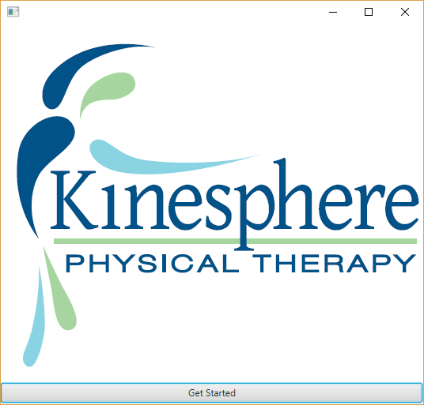

Kinesphere PT Visit Tracking Manager
------------------------------------

This application is custom built for Kinesphere PT as a means to track patient and client visits.



The usage guide and FAQ are [found here](docs/README.md)


## Technical info

Tech stack:
* Java 8
* JavaFX / FXML
* Postgres DB
* Griffon 2.13
* Spring 5.0.x


## Useful commands
To spin up the database, run this command in powershell from the `kpt-billing-manager-db-docker` folder:

```
$ docker-compose up
```


To generate new artifacts, first prepare the properties file _(/src/scripts/codegen/griffonartifact.properties)_, then run:

```
$ groovy generate-griffon-artifacts.groovy
```

To build the uber-jar, run this:

```
$ gradlew shadowJar
```

That command will place the jar file here: `build/libs/kpt-billing-manager-all.jar`

To run that jar, you'll need to include the `spring.datasource.url` JVM arg, as such:

```
$ java -Dspring.datasource.url=jdbc:postgresql://{server}:{port} -jar build/libs/kpt-billing-manager-all.jar
```

