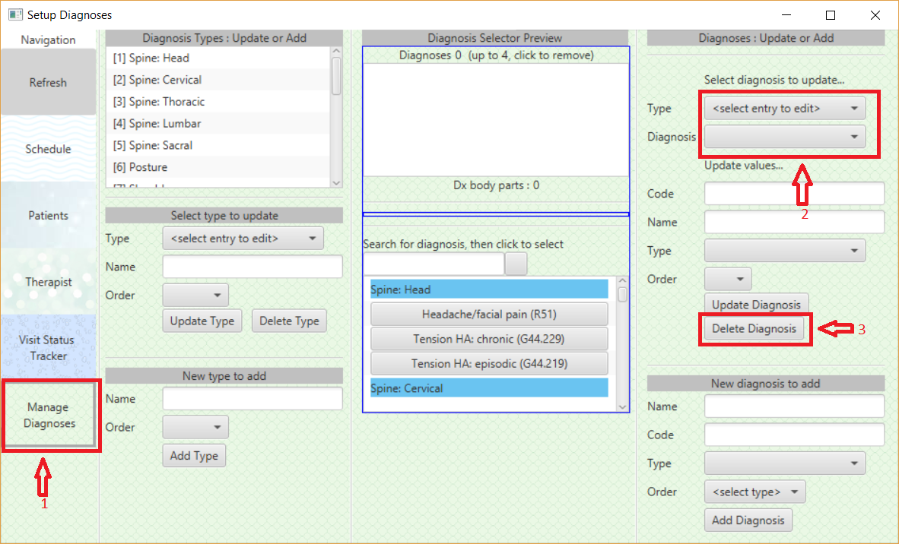

Kinesphere PT Visit Tracking Manager instruction manual
-------------------------------------------------------

This article explains how to use the application.

The application has 5 major sections:
* [Add & modify patient/client data](#add--modify-patientclient-data)
* [Schedule patient/client visits](#schedule-patientclient-visits)
* [Therapist enter visit (diagnosis/treatment) data](#therapist-enter-visit-diagnosistreatment-data)
* [Track visit status](#track-visit-status)
* [Add & modify diagnosis data](#manage-diagnoses)

## FAQ 
The FAQ (frequently asked questions) section provides shortcuts to the answers. 

* [What does the _Refresh_ button do?](#refresh-button)
* [How do I add a patient/client to the system?](#add-a-patientclient)
* [How do I modify a patient/client?](#edit-a-patientclient)
* [How do I schedule a visit?](#schedule-a-visit)
* [How do I modify a visit?](#modify-a-visit)
* [How do I delete a visit?](#delete-a-visit)
* [How do I enter data for a patient visit?](#therapist-enter-visit-diagnosistreatment-data)
* [How do I track a visit by status?](#track-visit-status)
* [How do I add a diagnosis type?](#add-a-diagnosis-type)
* [How do I edit a diagnosis type?](#update-a-diagnosis-type)
* [How do I re-order a diagnosis type?](#re-order-a-diagnosis-type)
* [How do I delete a diagnosis type?](#delete-a-diagnosis-type)
* [How do I add a diagnosis?](#add-a-diagnosis)
* [How do I edit a diagnosis?](#update-a-diagnosis)
* [How do I re-order a diagnosis?](#re-order-a-diagnosis)
* [How do I delete a diagnosis?](#delete-a-diagnosis)

## Refresh button
The _refresh_ button causes the application to reload data from the database.

It is used when another KPT Superhero adds a patient/client to the database, or adds/updates a diagnosis code, but that data does not show up in your application.  

## Add & modify patient/client data
The *Patient* screen allows the KPT Superhero to add patients & clients to the database, or edit patient & client data.

### Add a patient/client

* #1 - Click the _Patients_ navigation link
* #2 - Click the _Add Patient_ button

### Edit a patient/client

* #1 - Click the _Patients_ navigation link
* #2 - Click the name of a patient/client 
* #3 - Click the _Edit Patient_ button

## Schedule patient/client visits

### Schedule a visit

* #1 - Click the _Schedule_ navigation link
* #2 - Click the name of a patient/client 
  * Clicking any name will take you to the [visit setup](#visit-setup) screen 
  
**Notes:**
* #1 The selected therapist and date will be pre-populated in the [visit setup]() screen.

### Modify a visit

* #1 - Click the _Schedule_ navigation link
* #2 - Click the name of a patient/client 
* #3 - Click the _Edit_ button
  * Clicking the _Edit_ button will take you to the [visit setup](#visit-setup) screen. 
  

### Delete a visit

* #1 - Click the _Schedule_ navigation link
* #2 - Click the name of a patient/client 
* #3 - Click the _Delete_ button

## Visit Setup

The visit setup screen is used both for creating new visits, and modifying existing details for a visit.

Notes when creating a visit:
* The name of the selected therapist and date will be pre-populated based
on the selection from the screen that brought you here.

## Therapist enter visit (diagnosis/treatment) data
Explanation coming soon...

## Track visit status
Explanation coming soon...

## Manage Diagnoses

The *Manage Diagnoses* screen allows the KPT Superhero to add, update, re-order and delete diagnoses, and diagnosis types.

Notes:
* A *Diagnosis Type* represents a body part that diagnoses can be applied to, or a grouping of similar conditions.

### Add a diagnosis type

* #1 - Click the _Manage Diagnoses_ navigation link
* #2 - Enter the _Name_ for the new type, and select the order it will be sorted under
* #3 - Click the _Add Type_ button to create the new entry

### Update a diagnosis type

* #1 - Click the _Manage Diagnoses_ navigation link
* #2 - Select the _Diagnosis Type_ entry that you want to make changes to
* #3 - Make any changes to the _Name_ & _Order_ data
* #4 - Click the _Update Type_ button to save the changes

### Re-order a diagnosis type

* #1 - Click the _Manage Diagnoses_ navigation link
* #2 - Select the _Diagnosis Type_ entry that you want to make changes to
* #3 - Select the new _Order_ for the diagnosis type
* #4 - Click the _Update Type_ button to save the changes

### Delete a diagnosis type

* #1 - Click the _Manage Diagnoses_ navigation link
* #2 - Select the _Diagnosis Type_ from the list that you want to delete
* #3 - Click the _Delete Type_ button to delete the type

**Note:**
* A _Diagnosis Type_ cannot be deleted if it has any _Diagnoses_ attached to it.

### Add a diagnosis

* #1 - Click the _Manage Diagnoses_ navigation link
* #2 - Enter the _Name_ & _Code_ for the new entry
* #3 - Select the _Diagnosis Type_ to apply the entry to, and select the order within that type.
* #4 - Click the _Add Diagnosis_ button to create the new entry

### Update a diagnosis

* #1 - Click the _Manage Diagnoses_ navigation link
* #2 - Select the _Diagnosis Type_ and _Diagnosis_ entry that you want to make changes to
* #3 - Make any changes to the _Code_, _Name_, _Diagnosis Type_ & _Order_ data
* #4 - Click the _Update Diagnosis_ button to save the changes

### Re-order a diagnosis

* #1 - Click the _Manage Diagnoses_ navigation link
* #2 - Select the _Diagnosis Type_ & _Diagnosis_ entry that you want to make changes to
* #3 - Select the new _Order_ for the diagnosis within the _Diagnosis Type_
* #4 - Click the _Update Diagnosis_ button to save the changes

### Delete a diagnosis

* #1 - Click the _Manage Diagnoses_ navigation link
* #2 - Select the _Type_, then the _Diagnosis_ entry to delete
* #3 - Click the _Delete Diagnosis_ button to delete the entry

